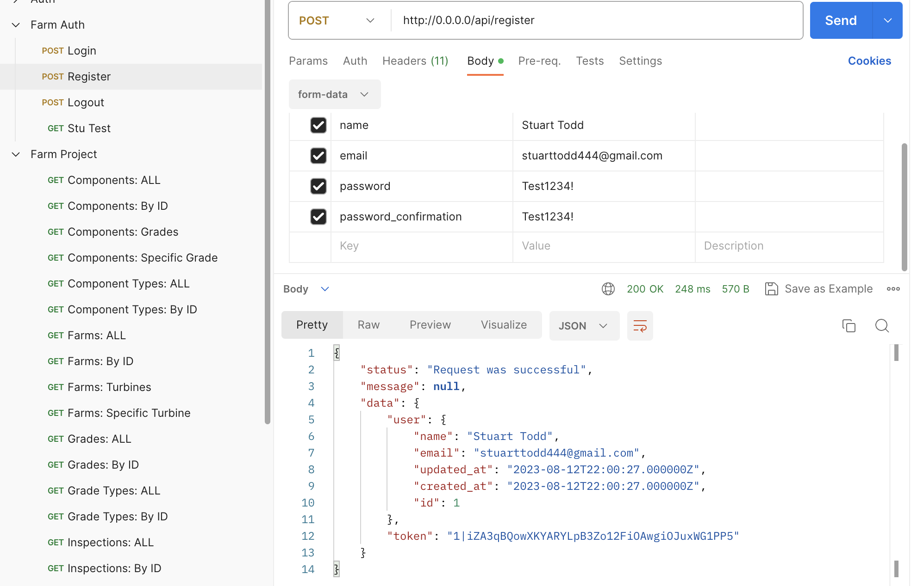
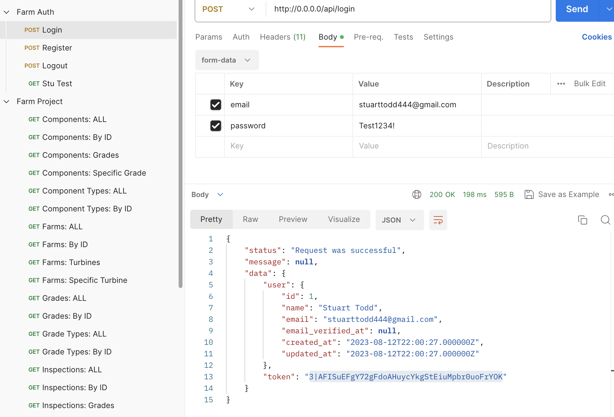
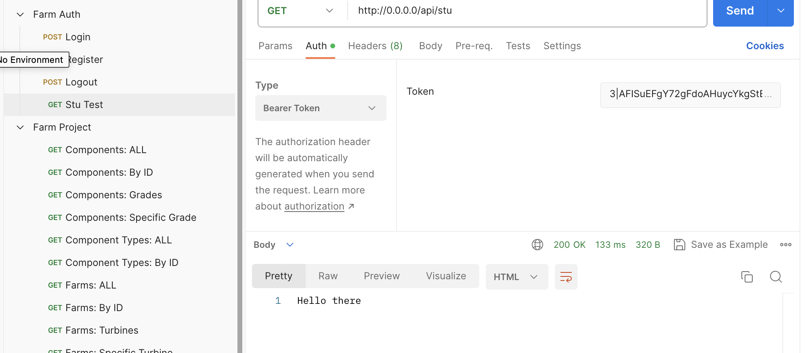
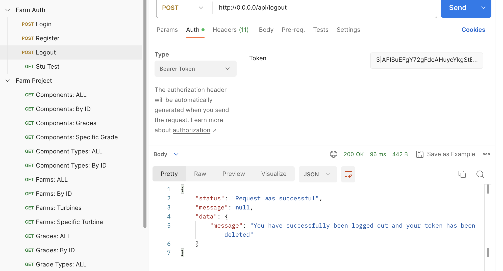
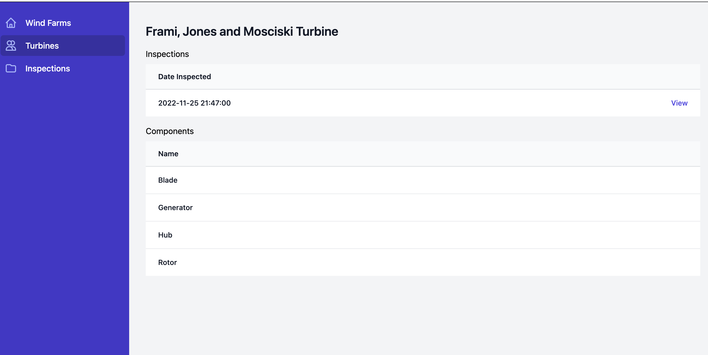

## About Software Development @ Cyberhawk


## The task
We've designed this task to try and give you the ability to show us what you can do and hopefully flex your technical and creative muscles. You can't show off too much here, show us you at your best and wow us!

To make things as simple as we could, we've opted to use [Laravel Sail](https://laravel.com/docs/8.x/sail) to provide a quick and convenient development environment, this will require you to install
[Docker Desktop](https://www.docker.com/products/docker-desktop) before you can start the test. We've provided [some more detailed instructions](#setting-everything-up) below in case this is your first time using Docker or Sail.

We'd like you to build an application that will display an example wind farm, its turbines and their components.
We'd like to be able to see components and their grades (measurement of damage/wear) ranging between 1 - 5.

For example, a turbine could contain the following components:
- Blade
- Rotor
- Hub
- Generator

Don't worry about using real names for components or accurate looking data, we're more interested in how you structure the application and how you present the data.

Don't be afraid of submitting incomplete code or code that isn't quite doing what you would like, just like your maths teacher, we like to see your working.
Just Document what you had hoped to achieve and your thoughts behind any unfinished code, so that we know what your plan was.

### Requirements
- Each Turbine should have a number of components
- A component can be given a grade from 1 to 5 (1 being perfect and 5 being completely broken/missing)
- Use Laravel Models to represent the Entities in the task.
- Conform to the spec provided in the `api-spec.yaml` file in the root of this project.
    - If your API matches the spec the provided pre-built front-end should be able to display the data provided via your API

### Bonus Points
- Automated tests
- API Authentication
- API Authorization
- Use of coding style guidelines (we use PSR-12 and AirBnb)
- Use of git with clear logical commits
- Specs/Plans/Designs

### Submitting The Task
We're not too fussy about how you submit the task, providing it gets to us and we're able to run it we'll be happy however here are some of the ways we commonly see:
- Fork this repo, work and add us as a collaborator on your GitHub repo and send us a link
- ZIP the project and email it to us at nick.stewart@thecyberhawk.com

## Setting Everything Up
As mentioned above we have chosen to make use of Laravel Sail as the foundation of this technical test.
- If you haven't already, you will need to install [Docker Desktop](https://www.docker.com/products/docker-desktop).
- One that is installed your next step is to install this projects composer dependencies (including Sail).
    - This will require either PHP 8 installed on your local machine or the use of [a small docker container](https://laravel.com/docs/8.x/sail#installing-composer-dependencies-for-existing-projects) that runs PHP 8 that can install the dependencies for us.
- If you haven't done so already copy the `.env.example` file to `.env`
    - If you are running a local development environment you may need to change some default ports in the `.env` file
        - We've already changed mysql to 33060 and NGINX to 81 for you
- It should now be time to [start Sail](https://laravel.com/docs/8.x/sail#starting-and-stopping-sail) and the task
- There is a file in the root of this project called `api-spec.yaml` this can be imported into your application of choice to ensure you're building your application to the spec that we're expecting. Some notable applications are:
    - Postman
    - Swagger
    - StopLight


### Installing Composer Dependencies
https://laravel.com/docs/9.x/sail#installing-composer-dependencies-for-existing-projects
```bash
docker run --rm \
-u "$(id -u):$(id -g)" \
-v $(pwd):/var/www/html \
-w /var/www/html \
laravelsail/php81-composer:latest \
composer install --ignore-platform-reqs
```

### Quick Tips
- Don't run npm/composer from your host, always run it via the sail command
    - This is because the docker container may not be able to write to the filesystem after you do so
- Ensure you have a valid .env file before starting sail for the first time.
    - Sail creates a docker volume which is persistent, so stopping/starting sail will not affect/fix issues in a volume (missing DB etc)

## Your Notes

### Action Classes
- Decided to encapsulate the API data fetching operations into Action classes. 
- Mainly for code re-usability and ease of testing.

### Additions
- Feature and Unit tests
- Migrations
- Seeders
- Factories
- Routes
- Controllers
- Models
- Resources
- Traits

### Sanctum
- Added Auth capability (see AuthController)
- login, register and logout routes
- Endpoints have been validated with Request classes
- Can be tested against the /api/stu route.
- Didn't protect the API routes as to not break the frontend

### Postman Screenshots






### App Screenshots




### Possible improvements
- I'd improve tests and test against custom exceptions.
- Could add Model scopes to clean up the Action classes.
- Could potentially add a repository class per model but it felt like overkill with the Action classes and ORM.
- Add CRUD with validation (Request classes)
